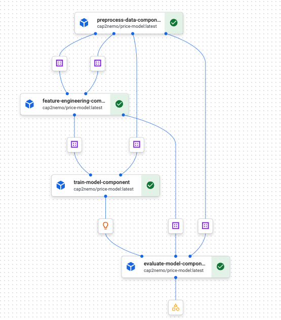
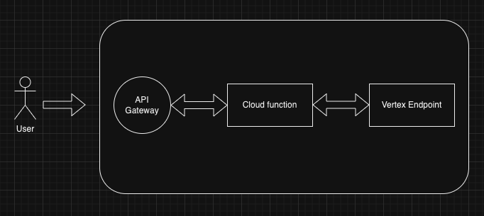

# test-task

## Content
1) Folder structure
2) Project overview
3) Endpoint
4) Comments and Improvements

## Folder structure

```
vertex_mlops
├── .github                               # Contains the CI CD pipeline
├── Dockerfile                            # Container for the python package (price model package)
├── Dockerfile.server                     # Container for the Vertex endpoint
├── README.md 
├── app                                   # Fastapi deployed in Vertex endpoint
│   ├── main.py
│   └── prestart.sh
├── cloud_function                        # Swagger configuration
│   ├── main.py
│   ├── openapi.yaml
│   └── requirements.txt
├── docs
├── infra
│   ├── artifact.tf
│   ├── iam.tf
│   ├── project.tf
│   ├── provider.tf
│   ├── storage.tf
│   ├── terraform.tfvars
│   └── variables.tf
├── pipelines   
│   ├── run_pipeline.py
│   └── train_pipeline.py
├── poetry.lock
├── price_model                             # Pricing model package
│   ├── __init__.py
│   ├── constants.py
│   ├── data.py
│   └── model.py
├── pyproject.toml
├── pytest.ini
├── requirements.txt
└── tests
    ├── __init__.py
    └── test_data.py
```

## Project overview
- The first step was to create a training pipeline in kubeflow. The pipeline creates a trained model and registers it to model registry. The figure below shows the steps of the kubeflow pipeline.
 

- The following diagram contains the app architecture


- Regarding the CI/CD pipeline, it contains 4 steps:
  - **test_and_lint**:  
    - This step runs `pytest` and checks the code styling using `Black`.  
    - The tests are in the `tests` folder, and the `.pre-commit` file contains the format styling tool.
  - **build_and_push_package_docker**:  
    - This step uses the `Dockerfile` and pushes the container to Artifact Registry.  
    - It contains the model functions.  
    - For more details, check the folder `price_model`.
  - **build_and_push_endpoint_docker**:  
    - It uploads the container to Artifact Registry.  
    - This container is used when the model is created in Model Registry.
  - **deploy_cloud_function**:  
    - It creates the cloud function that acts as an intermediary between the Vertex Endpoint and the API Gateway.

## Endpoint

### Prediction
Get the prediction given a name

**URL** : `https://price-api-3ijz0oh4.uc.gateway.dev/predict`

**Method** : `POST`

#### Data
 - product_name
 - mrp
 - price
 - pdp_url
 - brand_name
 - product_category
 - retailer
 - description
 - rating
 - review_count
 - style_attributes
 - total_sizes
 - available_size
 - color

#### Example

```
curl -X POST "https://price-api-3ijz0oh4.uc.gateway.dev/predict" \
     -H "Content-Type: application/json" \
     -d '{
          "instances": [
              {
                  "product_name": "Aerie Everyday Loves Lace Cheeky",
                  "mrp": "12.50 USD",
                  "price": "12.50 USD",
                  "pdp_url": "https://www.ae.com/aerie-everyday-loves-lace-cheeky-natural-nude/aerie/s-prod/1775_5973_153?cm=sDE-cEUR&catId=cat6150142",
                  "brand_name": "AERIE",
                  "product_category": "Cheekies",
                  "retailer": "Ae US",
                  "description": "Introducing Everyday Loves™: Made with love. Everyday, loves: Listen to your heart. Get comfy. Be Happy. Your go-to fave has more cheek peek & a whole lot of WOW. style: 1775-5973 | color: 153 Soft lace with the right amount of stretch Aerie undies: your panty drawer just got REAL! Low rise More cheek peek 97% Nylon, 3% Spandex Machine Wash Imported read more read less",
                  "rating": 5.0,
                  "review_count": 8.0,
                  "style_attributes": "",
                  "total_sizes": "",
                  "available_size": "",
                  "color": "Rugged Green"
              }
          ]
      }'
```

#### Response

**Code** : `200 OK`

```json
{
    "predictions":[ 13.07923984527588 ]
}
```

## Comments and Improvements
- Use a tool to monitor metrics of the API such as latency, error count.
- Integrate a tool to send alerts if a SLO was achieved, for example, if the average latency in the last day was higher than 15sec
- Improve CI/CD pipeline and deploy the vertex endpoint (I didn't have enough time to include it)
- Use Redis to reduce time, this is not a big improvement for this app due to its simplicity, but could be a good improvement for complex models
